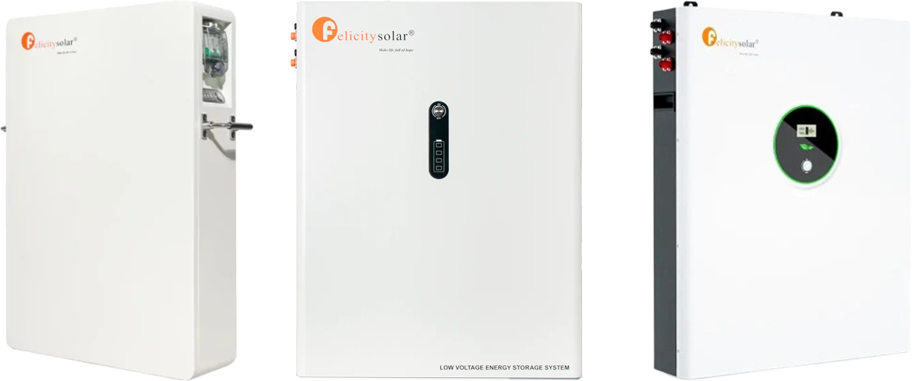

# CAN zu MQTT Schnittstelle für die Felicity LPBA-Serie

<p align="center">
  
</p>

Dieses Projekt bietet eine Schnittstelle zwischen CAN-Kommunikation und MQTT für die Felicity LPBA Speicher. Es ermöglicht dem Speicher, mit einem MQTT-Broker zu kommunizieren, um verschiedene Topics zu veröffentlichen, was eine Fernüberwachung ermöglicht. Zudem unterstützt das Programm die gleichzeitige Auslesung mehrerer parallel angeschlossener Speicher, wodurch es besonders flexibel und skalierbar in größeren Systemen einsetzbar ist.

## Inhaltsverzeichnis
- [Übersicht](#übersicht)
- [Funktionen](#funktionen)
- [Setup und Installation](#setup-und-installation)
- [Konfiguration](#konfiguration)
- [Verwendung](#verwendung)
- [MQTT-Topics](#mqtt-topics)
- [Lizenz](#lizenz)

## Übersicht
Das Skript liest Daten von dem Speicher über CAN, verarbeitet sie und veröffentlicht sie an einen MQTT-Broker.

## Funktionen
- Lesen von Registerwerten über CAN
- Automatische Erkennung der Anzahl parallel angeschlossenen Speicher
- Veröffentlichen der Daten an MQTT-Topics
- Protokollierung von Ereignissen und Fehlern

## Setup und Installation
### Benötigte Hardware
- Raspberry Pi
- SD-Karte
- [RS485 CAN HAT](https://www.amazon.de/gp/product/B09JKJCMHN)

### Voraussetzungen
- Python 3.x
- `can` Bibliothek für CANBUS
- `paho-mqtt` Bibliothek für MQTT-Kommunikation

### CAN Verkabelung
Stelle sicher, dass die Batterie richtig am RPi angeschlossen ist.

| LINK 0/LINK 1                | RPi RS485 CAN HAT (mit 120 Ohm Widerstand)                  |
|------------------------------|-------------------------------------|
| Pin 7                        | Anschluss L                         |
| Pin 8                        | Anschluss H                         | 

<p align="center">
  
</p>

### Installation

#### 1. [Installation RPi OS](https://www.raspberrypi.com/documentation/computers/getting-started.html)
#### 2. Installation RS485 CAN HAT
[RS485 CAN HAT am RPi](https://www.waveshare.com/wiki/RS485_CAN_HAT#CAN_Usage) nach Anleitung installieren und einrichten.

#### 3. Vorbereitungen am RPi
##### RPi OS und Pakete auf den aktuellen Stand bringen
```bash
sudo apt-get update
sudo apt-get upgrade -y
```
##### Installation von Python3 und der benötigten Bibliotheken
```bash
sudo apt-get install python3
sudo apt-get install python3-can
sudo apt-get install python3-paho-mqtt
```
##### Neustart des RPi
```bash
sudo reboot
```
#### 4. Installation des Programms
##### Programm auf den RPi hochladen
Lade das Programm als ZIP-Datei von Patreon herunter und entpacke es. Übertrage anschließend den entpackten Ordner mit einem FTP-Programm auf deinen Raspberry Pi in das Verzeichnis /home/pi/.

##### Öffne das Projektverzeichnis
```bash
cd Feli_LPBA_CAN_to_MQTT
```
##### Anpassen der [Konfiguration](#konfiguration) des Programms
```bash
sudo nano feli_lpba_can_to_mqtt_config.py
```
Hinweis: Editor mit STRG+X beenden, dabei das Speichern nicht vergessen! „Save modified buffer?“ -> y

##### Fertig!
Die [Verwendung](#verwendung) des Programmes ist nachfolgend beschrieben

## Konfiguration
### Batterie Konfiguration
Setze die Batterie-Nummer (falls mehrere Batterien ausgelesen werden):
```python
BATTERY_NUMBER = "0001"
```

### CAN Konfiguration
Herausfinden des angeschlossenen CAN
```bash
sudo ifconfig
```

Setzen der CAN Schnittstelle:
```python
CAN_CHANNEL = "can0"
```

### MQTT Konfiguration
Setze die Verbindungsparameter des MQTT-Brokers:
```python
MQTT_BROKER = "192.168.178.123"
MQTT_PORT = 1883
MQTT_USERNAME = "mqtt"
MQTT_PASSWORD = "12345"
```

### Protokollierung
Das Skript protokolliert verschiedene Ereignisse und Fehler. Die Protokolldatei wird durch die Variable `LOG_FILE` angegeben. Setze hierfür die Protokollierungsparameter:
```python
LOG_LEVEL = logging.INFO
LOG_FILE = "/home/pi/Feli_LPBA_CAN_to_MQTT/feli_lpba_can_to_mqtt.log"
```
#### Protokollierungsstufen
- `DEBUG`: Detaillierte Informationen zur Diagnose von Problemen.
- `INFO`: Bestätigung, dass alles wie erwartet funktioniert.
- `WARNING`: Ein Hinweis darauf, dass etwas Unerwartetes passiert ist.
- `ERROR`: Ein ernsteres Problem.
- `CRITICAL`: Ein sehr ernstes Problem.

## Verwendung

### Ausführen des Programms
Führe das Skript aus:
   ```bash
   python3 feli_lpba_can_to_mqtt.py
   ```

### Service einrichten
Erstelle eine neue Service-Datei für systemd
```bash
sudo nano /etc/systemd/system/feli_lpba_can_to_mqtt.service
```

Füge folgenden Inhalt ein (bitte Pfad anpassen)
```bash
[Unit]
Description=CAN to MQTT Service for Felicity LPBA
After=network.target network-online.target
Wants=network-online.target

[Service]
ExecStart=/usr/bin/python3 /home/pi/Feli_LPBA_CAN_to_MQTT/feli_lpba_can_to_mqtt.py
WorkingDirectory=/home/pi/Feli_LPBA_CAN_to_MQTT
StandardOutput=inherit
StandardError=inherit
Restart=always
User=pi

[Install]
WantedBy=multi-user.target
```

Aktiviere den neuen Service, sodass er beim Booten automatisch gestartet wird.
```bash
sudo systemctl enable feli_lpba_can_to_mqtt.service
```

Starte den Service
```bash
sudo systemctl start feli_lpba_can_to_mqtt.service
```

## MQTT Topics

Ersetze `{BATTERY_NUMBER}` durch die tatsächliche Batterie-Nummer und `{Modul_Nr}` durch die tatsächliche Modul-Nummer in allen Topics.

| Basis-Topic                                               |
|-----------------------------------------------------------|
| solar/feli_lpba_battery/{BATTERY_NUMBER}/{Modul_Nr}/         |

Die vollständigen MQTT-Topics setzen sich aus dem Basis-Topic und dem jeweiligen Feldnamen zusammen.
Beispiel: `solar/feli_lpba_battery/0001/0001/Battery_SOC`

| Feldname                     | Beschreibung                       | Wert                                              |
|------------------------------|------------------------------------|---------------------------------------------------|
| Battery_SOC                  | Ladezustand                        | Integer (in %)                                    |
| -                            | -                                  | -                                                 |
| Battery_Voltage              | Spannung                           | Gleitkommazahl (in Volt)                          |
| Battery_Current              | Strom                              | Gleitkommazahl (in Ampere)                        |
| Battery_Power                | Leistung                           | Gleitkommazahl (in Watt)                          |
| -                            | -                                  | -                                                 |
| Battery_Temperature_01       | Temperatur Sensor 1                | Gleitkommazahl (in °C)                            |
| Battery_Temperature_02       | Temperatur Sensor 2                | Gleitkommazahl (in °C)                            |
| Battery_Temperature_03       | Temperatur Sensor 3                | Gleitkommazahl (in °C)                            |
| Battery_Temperature_04       | Temperatur Sensor 4                | Gleitkommazahl (in °C)                            |
| -                            | -                                  | -                                                 |
| Battery_Cell_01_Voltage      | Spannung Zelle 1                   | Gleitkommazahl (in Volt)                          |
| Battery_Cell_02_Voltage      | Spannung Zelle 2                   | Gleitkommazahl (in Volt)                          |
| Battery_Cell_03_Voltage      | Spannung Zelle 3                   | Gleitkommazahl (in Volt)                          |
| Battery_Cell_04_Voltage      | Spannung Zelle 4                   | Gleitkommazahl (in Volt)                          |
| Battery_Cell_05_Voltage      | Spannung Zelle 5                   | Gleitkommazahl (in Volt)                          |
| Battery_Cell_06_Voltage      | Spannung Zelle 6                   | Gleitkommazahl (in Volt)                          |
| Battery_Cell_07_Voltage      | Spannung Zelle 7                   | Gleitkommazahl (in Volt)                          |
| Battery_Cell_08_Voltage      | Spannung Zelle 8                   | Gleitkommazahl (in Volt)                          |
| Battery_Cell_09_Voltage      | Spannung Zelle 9                   | Gleitkommazahl (in Volt)                          |
| Battery_Cell_10_Voltage      | Spannung Zelle 10                  | Gleitkommazahl (in Volt)                          |
| Battery_Cell_11_Voltage      | Spannung Zelle 11                  | Gleitkommazahl (in Volt)                          |
| Battery_Cell_12_Voltage      | Spannung Zelle 12                  | Gleitkommazahl (in Volt)                          |
| Battery_Cell_13_Voltage      | Spannung Zelle 13                  | Gleitkommazahl (in Volt)                          |
| Battery_Cell_14_Voltage      | Spannung Zelle 14                  | Gleitkommazahl (in Volt)                          |
| Battery_Cell_15_Voltage      | Spannung Zelle 15                  | Gleitkommazahl (in Volt)                          |
| Battery_Cell_16_Voltage      | Spannung Zelle 16                  | Gleitkommazahl (in Volt)                          |

## Lizenz
Dieses Projekt ist unter der MIT-Lizenz lizenziert. Siehe die [LICENSE](LICENSE) Datei für Details.
